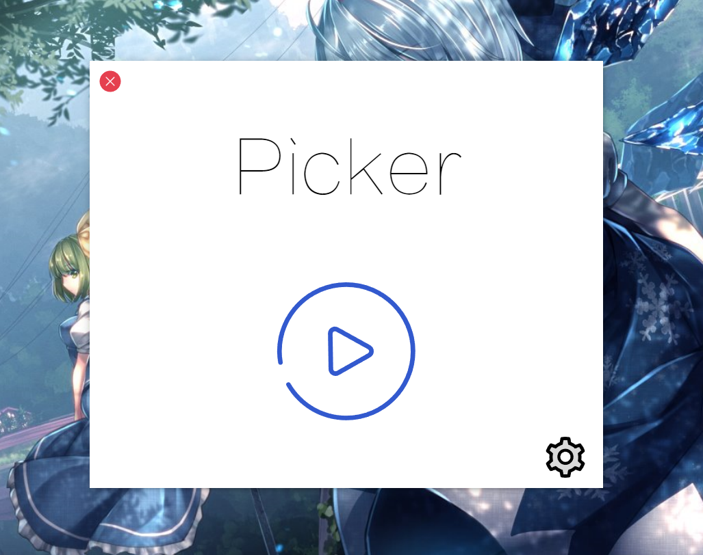

# Picker

An easy program designed for Chinese Teachers to choose one of their students randomly.

## Introduction

This idea of the project was based on my former project named _Draw Assistance_, which was written in C# and hard to maintain. Instead of keeping the maintaince, I created this project to develop without the sticky-and-ugly codes I've written. And by the way, to learn HTML, CSS, JavaScript, and so on.

## Screenshots



## Start

This project requires Electron 4.1.4 and Node.js 11.12.0.

```bash
$ git clone https://github.com/FrostedIce/Picker.git
$ cd Picker
$ npm install
$ electron .
```